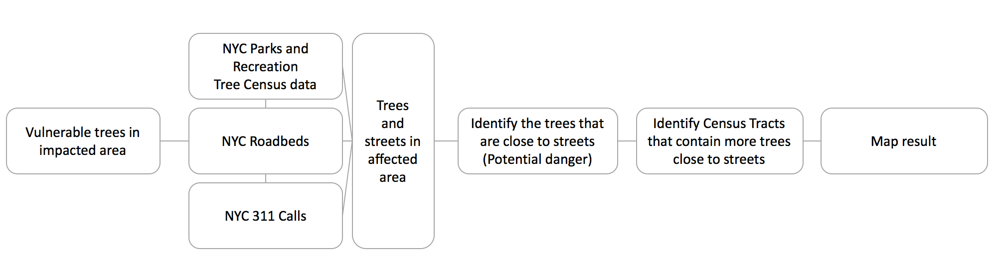

# Brooklyn/Queens 2010 Tornado Emergency Response
Mayor's Office of Data Analytics Data Drill - Emergency response for Brooklyn/Queens 2010 Tornado

For Urban Informatics fro Smart and Sustainable Cities Class - NYU-CUSP Spring 2017

The exercise was create an operational question and use data analytics to approach this question and inform the decision makers in NYC to be awared of the conclusions and help them on the decisions.

#### Operational question: Where is the Sensitive Infrastructure Located? 

The question was answered in two ways:
- Looking for infrastructure in the Tornado path and calculating the damage exposure taking in consideration importance and sensitivity;
- For the tornado path, look for the trees that have more potential to generate damage to people, houses and cars. To do that, we filtered the trees that are closer to streets.

Here is the workflow of the project:

The notebooks in this repository aims to find conclusions for both questions mentioned above.

The work was presented in May 8th, 2017
- link for the article: https://docs.google.com/document/d/1FKKGq8MD12yC_FWnwKHPAILghZGL8eRN2A-vM0pta40/edit?usp=sharing
- link for the presentation: https://docs.google.com/presentation/d/1b5iusUMJkyJNO1QEVozFJxPmDgK25UfI4b78BktHKQI/edit?usp=sharing
